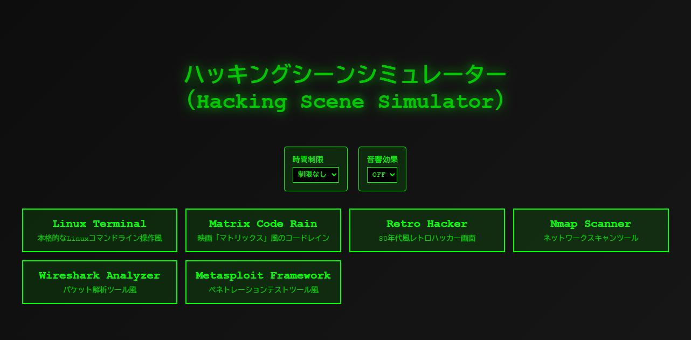

# ハッキングシーンシミュレーター（Hacking Scene Simulator）

**Day 5 - セキュリティツールをAIで作ってみよう 100日チャレンジ**

映画やTV番組のハッキングシーンの撮影・取材に使用できる、リアルなハッキング操作風の画面シミュレーターです。

## 🌐 デモページ

**👉 https://ipusiron.github.io/hacking-scene-simulator/**

ブラウザーで直接お試しいただけます。フルスクリーン表示で本格的なハッキングシーンをお楽しみください。

## 📸 スクリーンショット

*ハッキングシーンシミュレーターのメイン画面*

## 🎬 概要

このWebアプリケーションは、実際のハッキングツールの操作画面を模したシミュレーション環境を提供します。取材やデモンストレーション、教育目的での使用を想定して設計されています。

## ✨ 特徴

- **6種類のリアルなシーン**: Linux Terminal、Matrix Code Rain、Retro Hacker、Nmap Scanner、Wireshark Analyzer、Metasploit Framework
- **全画面表示対応**: 撮影に適したフルスクリーン表示
- **音響効果**: リアルなビープ音やタイピング音（ON/OFF切替可能）
- **時間制限機能**: 30秒〜10分、または制限なしの設定
- **安全な操作**: ESCキーのみで終了、その他のキー操作は無視
- **レスポンシブ対応**: 様々な画面サイズに対応

## 🖥️ シーン詳細

### 1. Linux Terminal
- 実際のLinuxコマンドライン操作を模擬
- nmap、ssh、権限昇格などのリアルなコマンド実行
- CTFフラグの発見まで含む本格的なシナリオ

### 2. Matrix Code Rain
- 映画「マトリックス」風の0と1のバイナリコード
- 1文字ずつ降ってくる本格的なアニメーション
- 先頭文字は白、後続は緑のグラデーション効果

### 3. Retro Hacker
- 80年代風のレトロなハッカー画面
- サイバーパンク的な演出
- プログレスバーやステータス表示

### 4. Nmap Scanner
- 実際のNmapネットワークスキャンツールを模擬
- リアルなポートスキャン結果
- ホスト発見からサービス検出まで

### 5. Wireshark Analyzer
- パケット解析ツールの詳細表示
- 実際のネットワークパケット情報
- プロトコル解析の様子を再現

### 6. Metasploit Framework
- ペネトレーションテストツールの操作画面
- ランダムなアスキーアート表示
- エクスプロイト実行からMeterpreterセッションまで

## 🚀 使用方法

### 基本操作
1. Webーでアプリケーションを開く
2. 時間制限と音響効果の設定を選択
3. 6つのシーンから好みのものを選択
4. 自動的にフルスクリーン表示が開始
5. ESCキーまたはQ/qキーで終了

### 設定項目
- **時間制限**: 制限なし、30秒、1分、2分、5分、10分
- **音響効果**: ON/OFF切替可能

### 終了方法
- **ESCキー**: シミュレーション終了
- **Q/qキー**: シミュレーション終了
- フルスクリーンの手動解除でも自動終了

## 📋 技術仕様

- **言語**: HTML5 + CSS3 + JavaScript（ES6）
- **ブラウザー**: モダンブラウザー対応（Chrome、Firefox、Safari、Edge）
- **フレームワーク**: バニラJS（外部依存なし）
- **音響**: Web Audio API使用
- **レスポンシブ**: CSS Grid + Flexbox

## 🎯 使用場面

- **映画・TV番組**: ハッキングシーンの撮影
- **取材・インタビュー**: セキュリティ関連の背景映像
- **教育・講演**: サイバーセキュリティの説明
- **デモンストレーション**: 技術プレゼンテーション
- **イベント**: セキュリティカンファレンス等

## ⚠️ 注意事項

- このシミュレーターは教育・取材目的のものです
- 実際のハッキング行為は行いません
- 表示されるコマンドやログは模擬的なものです
- 実際のシステムへの影響は一切ありません

## 🔧 カスタマイズ

コードはオープンソースで、以下のカスタマイズが可能です：

- 新しいシーンの追加
- コマンドやログの内容変更
- 色彩やアニメーション速度の調整
- 音響効果の追加・変更

## 📄 ライセンス

MIT License - 教育・研究・取材目的での使用を歓迎します。

---

> **Day 5 完了！** 100日チャレンジの一環として、実用的なハッキングシーンシミュレーターを作成しました。取材や教育現場でぜひご活用ください。