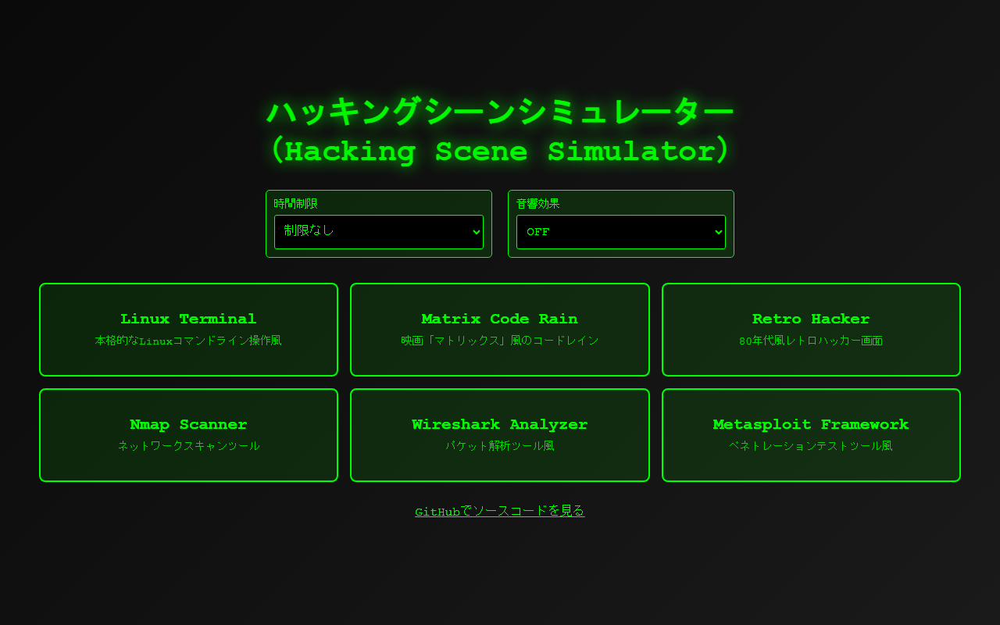
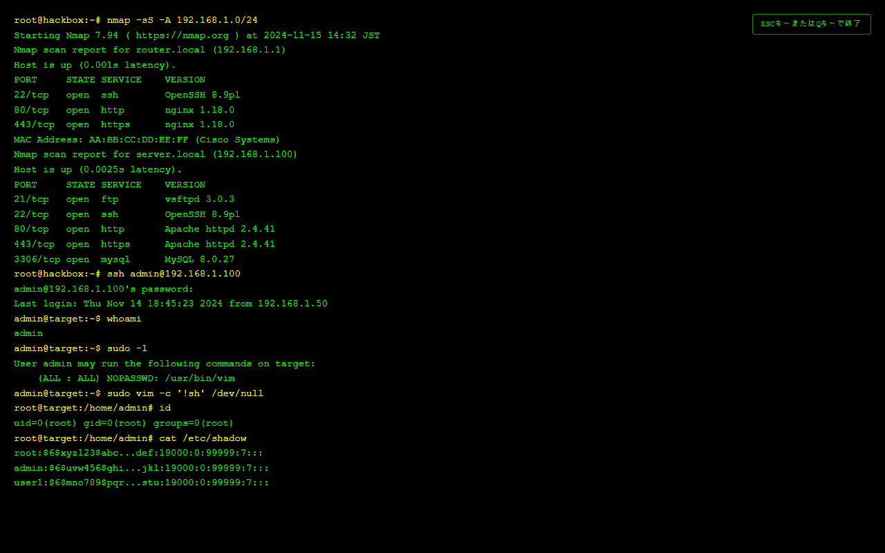
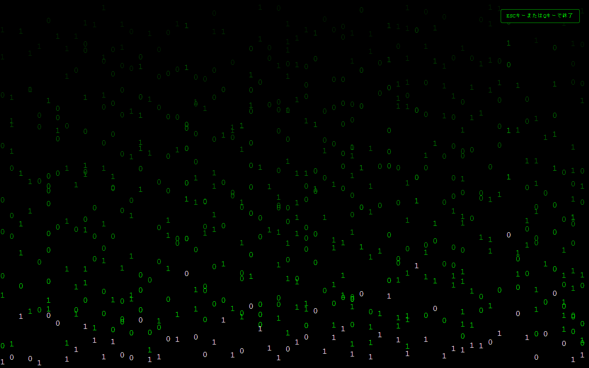
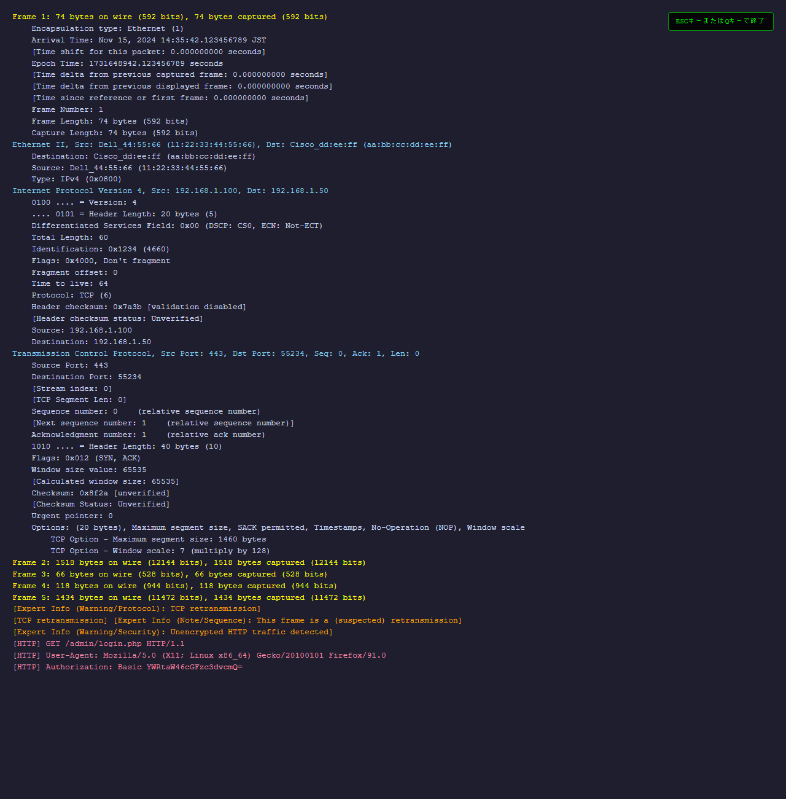
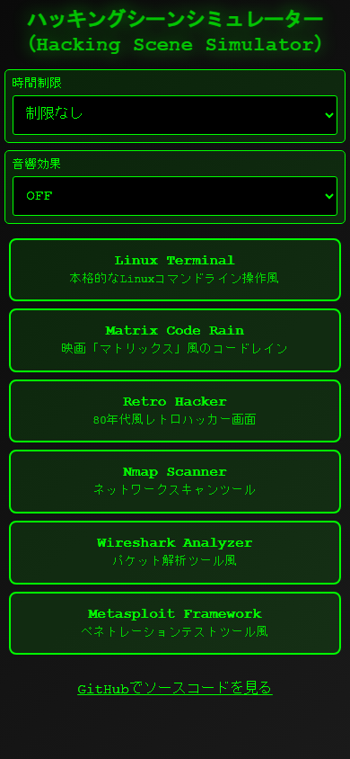

<!--
---
id: day006
slug: hacking-scene-simulator

title: "Hacking Scene Simulator"

subtitle_ja: "映画・取材用ハッキング画面シミュレーター"
subtitle_en: "Realistic Hacking Screen Simulator for Filming"

description_ja: "映画やTV番組のハッキングシーン撮影・取材に使用できる、6種類のリアルなハッキング操作風画面をシミュレートするWebアプリケーション"
description_en: "A web application simulating 6 types of realistic hacking screens for filming, journalism, and educational purposes"

category_ja:
  - ハッカー文化
  - シミュレーター
  - 教育・デモ
category_en:
  - Hacker Culture
  - Simulator
  - Education & Demo

difficulty: 1

tags:
  - terminal
  - matrix
  - nmap
  - wireshark
  - metasploit
  - fullscreen
  - animation

repo_url: "https://github.com/ipusiron/hacking-scene-simulator"
demo_url: "https://ipusiron.github.io/hacking-scene-simulator/"

hub: true
---
-->

# Hacking Scene Simulator - 撮影・取材用のハッキング画面シミュレーター


[](https://ipusiron.github.io/hacking-scene-simulator/)

**Day006 - 生成AIで作るセキュリティツール100**

映画やTV番組のハッキングシーンの撮影・取材に使用できる、リアルなハッキング操作風の画面シミュレーターです。
実際のツールの操作画面を模した6種類の映像を用意し、取材やデモンストレーション、教育目的での使用を想定しています。

## 🌐 デモページ

**👉 https://ipusiron.github.io/hacking-scene-simulator/**

ブラウザーで直接お試しいただけます。フルスクリーン表示で本格的なハッキングシーンをお楽しみください。

## 📸 スクリーンショット

<p align="center">
  
</p>

> *6種類のシーンと時間制限・音響効果を選べます。末尾にはGitHubへのリンクがあります。*

<p align="center">
  
</p>

> *プロンプトは黄色、/etc/shadowの架空のハッシュ行は通常の緑で表示します。*

<p align="center">
  
</p>

> *各列の最下端が白い先頭文字で、後続は上へ向かって暗い緑になります。*

<p align="center">
  
</p>

> *Frame 1、警告、HTTP行をそれぞれ黄色・オレンジ・赤で表示します。*

<p align="center">
  
</p>

> *390px幅でも最下部までスクロールでき、6つ目のボタンとフッターに到達できます。*

## ✨ 機能

- **6種類のリアルなシーン**：Linux Terminal、Matrix Code Rain、Retro Hacker、Nmap Scanner、Wireshark Analyzer、Metasploit Framework
- **全画面表示対応**：撮影に適したフルスクリーン表示
- **音響効果**：リアルなビープ音やタイピング音（ON/OFF切替可能）
- **時間制限機能**：30秒〜10分、または制限なしの設定
- **安全な操作**：ESCキー・Qキー（タッチ端末はタップまたは上スワイプ）で終了。Ctrl・Alt・Commandを伴うキーはブラウザーに渡すので、リロードやタブ操作は妨げない。
- **レスポンシブ対応**：さまざまな画面サイズに対応

## 🖥️ シーン詳細

### 1. Linux Terminal

- 実際のLinuxコマンドライン操作を模擬
- nmap、ssh、権限昇格などのコマンド操作の再現
- CTFフラグの発見まで含む本格的なシナリオ

コマンド・ログ・ハッシュ・CTFフラグはすべて架空で、実行されることはありません。

### 2. Matrix Code Rain

- 映画「マトリックス」風の0と1のバイナリコード
- 1文字ずつ降ってくる本格的なアニメーション
- 先頭文字は白、後続は緑のグラデーション効果

表示する0と1は架空の演出で、実データや通信ログではありません。

### 3. Retro Hacker

- 80年代風のレトロなハッカー画面
- サイバーパンク的な演出
- プログレスバーやステータス表示

画面に出る作戦実行ログは架空の演出です。

### 4. Nmap Scanner

- 実際のNmapネットワークスキャンツールを模擬
- リアルなポートスキャン結果
- ホスト発見からサービス検出まで

ポートとホストの情報は架空で、実際のスキャンは行いません。

### 5. Wireshark Analyzer

- パケット解析ツールの詳細表示
- 架空のネットワークパケット情報
- プロトコル解析の様子を再現

パケットの詳細やHTTPログは架空で、通信の取得は行いません。

### 6. Metasploit Framework

- ペネトレーションテストツールの操作画面
- ランダムなアスキーアート表示
- 起動バナーから最初のmsf6プロンプトまでは一括表示し、その後の操作ログは1行ずつ再生
- エクスプロイト実行からMeterpreterセッションまで

コマンドやセッションログは架空で、実際の攻撃やコマンド実行は行いません。

### シーン一覧

| シーン | 画面に出るもの | 行数 |
|---|---|---|
| Linux Terminal | ポートスキャンから権限昇格までの操作ログ | 44 |
| Matrix Code Rain | 0と1が降るコードレイン | — |
| Retro Hacker | 80年代風の作戦実行ログ | 39 |
| Nmap Scanner | ネットワークスキャンの出力 | 69 |
| Wireshark Analyzer | パケットの詳細表示 | 62 |
| Metasploit Framework | アスキーアートとエクスプロイト実行ログ | 66〜68 |

## 📖 使い方

### 基本操作

1. Webブラウザーでアプリケーションを開く
2. 時間制限と音響効果の設定を選択
3. 6つのシーンから好みのものを選択
4. 自動的にフルスクリーン表示が開始
5. ESCキーまたはQ/qキーで終了

### 設定項目

- **時間制限**：制限なし、30秒、1分、2分、5分、10分
- **音響効果**：ON/OFF切替可能

### 終了方法

- **ESCキー**：シミュレーション終了
- **Q/qキー**：シミュレーション終了
- タッチ端末：タップまたは上スワイプで終了
- フルスクリーンの手動解除でも自動終了

ESC／Q以外のキーは抑止しません。F5やTab、Ctrl・Alt・Commandを伴うキー操作もブラウザーへ渡します。
フルスクリーンが許可されない場合も、通常のブラウザー画面で再生を続けます。

## 🎯 ユースケース

- **映画・TV番組**：ハッキングシーンの撮影
- **取材・インタビュー**：セキュリティ関連の背景映像
- **教育・講演**：サイバーセキュリティの説明
- **デモンストレーション**：技術プレゼンテーション
- **イベント**：セキュリティカンファレンスなど

## 🔬 技術的な説明

- **言語**：HTML5 + CSS3 + JavaScript（ES6）
- **ブラウザー**：モダンブラウザー対応（Chrome、Firefox、Safari、Edge）
- **フレームワーク**：バニラJS（外部依存なし）
- **音響**：Web Audio API使用
- **レスポンシブ**：CSS Grid + Flexbox

- **データと分類**：scenes.jsにデータと純粋関数を分離し、行の色分けを正規表現で判定
- **行送り**：再帰的なsetTimeoutで行ごとに待ち時間を再計算。Metasploitの起動部分は初回・ループ再開時とも一括表示
- **Matrix描画**：requestAnimationFrameを使用。動きを減らす設定では降下速度を半分に調整
- **後片付け**：停止・切り替え時に行送り、再開、タイマー、描画、リサイズの予約を解放

## 🧪 テスト

Node 22以上で、次のコマンドを実行します。外部依存はなく、インストール作業は不要です。

```sh
npm test
```

node --testで7ファイルのテストを実行します。GitHub Actionsでもpushとpull_requestのたびに自動実行します。

- 分類ルール、タイマー表記、行送りの待ち時間
- Metasploitの起動時の一括表示、以降の1行送り、ループ再開、停止・切り替え時の予約解除
- Nmapのポート集計・ホスト数・サービス数・所要時間
- Wiresharkのフレーム長・ヘッダー長・タイムスタンプ・TCPオプション
- Linuxのログの日付と曜日、Metasploitのアーキテクチャ
- アスキーアートの文字幅、架空のIPアドレスとCTFフラグ
- READMEのシーン一覧・画像参照・YAMLメタデータ
- HTMLの構造、配色のコントラスト、ファイルの整形

画面に出る内容を、実物のツールの出力として筋が通る状態に保つための仕組みです。
CTFフラグは英数字とアンダースコアを基本とし、既存のMetasploit用フラグ1件だけ末尾の!を許可しています。

## 🔒 セキュリティ・プライバシー

このツールは実際の攻撃・通信・スキャン・コマンド実行を一切行いません。
表示されるログ・IPアドレス・ハッシュ・CTFフラグ・認証情報はすべて架空です。
WiresharkのBasic認証例は、admin:passwordのBase64表記を意図的に使っています。Basic認証の符号化が暗号化ではないことを示す教材です。

ページのファイルを読み込んだあとは、再生のための通信は発生しません。入力を保存せず、localStorageやCookieも使いません。
文字列はtextContentで表示し、CSPでスクリプトとスタイルの読み込み元を制限しています。referrerはno-referrerです。
frame-ancestorsはmetaでは指定できないため、含めていません。

## ⚠️ 注意事項

- このシミュレーターは教育・取材目的のものである。
- 実際のハッキング行為は行わない。
- 表示されるコマンドやログは模擬的なものである。
- 実際のシステムへの影響は一切ない。

## 🔧 カスタマイズ

コードはオープンソースで、以下のカスタマイズが可能です。
シーンのデータはscenes.jsにあります。変更後はnpm testでデータ整合を確認してください。

- 新しいシーンの追加
- コマンドやログの内容変更
- 色彩やアニメーション速度の調整
- 音響効果の追加・変更

## 📁 ディレクトリー構造

```text
hacking-scene-simulator/
├── index.html                # 選択画面とシミュレーター
├── scenes.js                 # 架空のログと分類・タイマーの純粋関数
├── script.js                 # DOM・再生・入力・音声の処理
├── style.css                 # 配色とレスポンシブ表示
├── assets/                   # README用のスクリーンショット5枚
│   ├── screenshot.png
│   ├── screenshot2.png
│   ├── screenshot3.png
│   ├── screenshot4.png
│   └── screenshot5.png
├── test/                     # 依存なしの自動テスト7ファイル
│   ├── scenes.test.js
│   ├── scene-data.test.js
│   ├── playback.test.js
│   ├── html.test.js
│   ├── contrast.test.js
│   ├── readme.test.js
│   └── format.test.js
├── .github/workflows/test.yml # push・pull_request時のCI
├── package.json              # npm testの定義
├── LICENSE                   # MITライセンス
├── README.md                 # 使い方と技術説明
├── CLAUDE.md                 # 開発時の案内
└── ss.png                    # 旧画面の画像（参照せず保存）
```

## 💻 動作環境

Chrome・Edge・Firefox・Safariの最新版を対象としています。
index.htmlをfile://で直接開いても動きます。テストの実行にはNode 22以上が必要です。
フルスクリーンや音響効果の対応は、ブラウザーと端末の制限に従います。

## 📄 ライセンス

このプロジェクトは[MITライセンス](./LICENSE)の下で公開されています。

## 🛠️ このツールについて

本ツールは、「生成AIで作るセキュリティツール100」プロジェクトの一環として開発されました。このプロジェクトでは、AIの支援を活用しながら、セキュリティに関連するさまざまなツールを100日間にわたり制作・公開していく取り組みを行っています。

プロジェクトの詳細や他のツールについては、以下のページをご覧ください。

🔗 [https://akademeia.info/?page_id=42163](https://akademeia.info/?page_id=42163)
